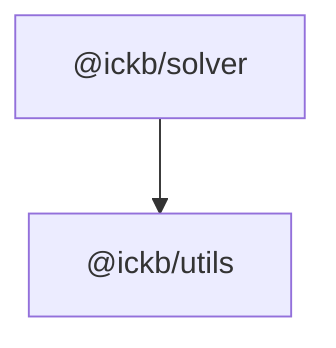

# iCKB/Solver

A Linear Solver, a barebones fork of [Ivordir/YALPS](https://github.com/Ivordir/YALPS).

## YALPS Quick Guide

This guide covers the usage of YALPS, a lightweight, performant linear programming solver, for solving linear optimization problems. YALPS models LP problems using a column-wise approach. Model can be defined using object or iterable formats.

## Real-World Examples

### Cutting Stock Testcase in Object Format

This example illustrates minimizing costs while ensuring a minimum length constraint for stock.

```typescript
const cuttingStockModel = {
  direction: "minimize" as const,  // Opposite: direction: "maximize",
  objective: "cost",
  variables: {
    "21": { length: 21, cost: 75 },
    "26": { length: 26, cost: 90 },
    "31": { length: 31, cost: 105 },
    "36": { length: 36, cost: 120 }
  },
  constraints: {
    length: { min: 25 } 
    // Other : { max: value },
    // Other2 : { equal: value },
    // Other3 : { min: lower, max: upper }
  },
  integers: ["21", "26", "31", "36"], // Or here `integers: true`.
  binaries: [] // Same rules as integers.
};

const cuttingStockSolution = solve(cuttingStockModel);
// Result: { 
//   status: "optimal", 
//   result: 90, 
//   variables: [ ["26", 1] ]
// }
```

### Berlin Air Lift Testcase with Iterable Format and Helper Functions

YALPS provides helper functions for generating constraint objects:

- `lessEq(value: number)` – creates a `{ max: value }` constraint.
- `greaterEq(value: number)` – creates a `{ min: value }` constraint.
- `equalTo(value: number)` – creates a `{ equal: value }` constraint.
- `inRange(lower: number, upper: number)` – creates a constraint with both `{ min: lower, max: upper }`.

This example demonstrates maximizing capacity while adhering to constraints on planes, persons, costs, and a specific condition for "yankees."

```typescript
// Define constraints using helper functions
const constraints = new Map<string, Constraint>()
  .set("plane", lessEq(44)) 
  .set("person", lessEq(512))
  .set("cost", lessEq(300))
  .set("yankees", equalTo(0));

// Define variables using object and iterable types
const brit = new Map<string, number>()
  .set("capacity", 20000)
  .set("plane", 1)
  .set("person", 8)
  .set("cost", 5)
  .set("yankees", -2);

const yank = new Map<string, number>()
  .set("capacity", 30000)
  .set("plane", 1)
  .set("person", 16)
  .set("cost", 9)
  .set("yankees", 1);

const berlinModel = {
  direction: "maximize" as const,
  objective: "capacity",
  constraints,
  variables: {
    brit,
    yank
  }
};

const berlinSolution = solve(berlinModel);
// Result: { 
//   status: "optimal", 
//   result: 1024000, 
//   variables: [ ["brit", 12.8], ["yank", 25.6] ] 
// }
```

## Advanced Options

For complex problems, configure advanced options by passing an options object to the `solve` function:

```typescript
const options = {
  precision: 1E-8,     // Treat numbers <= this value as zero
  checkCycles: false,  // Enable explicit cycle checking if needed
  maxPivots: 8192,     // Maximum number of simplex pivots
  tolerance: 0.05,     // Tolerance for near-optimal integer solutions
  timeout: 1000,       // Maximum time in milliseconds for the solve
  maxIterations: 32768,// Maximum iterations for branch and cut
  includeZeroVariables: false // Keep 0 value variables in the solution
};

const solutionWithOptions = solve(model, options);
```

## Dependencies



## Epoch Semantic Versioning

This repository follows [Epoch Semantic Versioning](https://antfu.me/posts/epoch-semver). In short ESV aims to provide a more nuanced and effective way to communicate software changes, allowing for better user understanding and smoother upgrades.

## Licensing

This source code, crafted with care by [Ivordir](https://github.com/Ivordir) and slightly modified by [Phroi](https://phroi.com/), is freely available on [GitHub](https://github.com/ickb/solver) and it is released under the [MIT License](./LICENSE).
