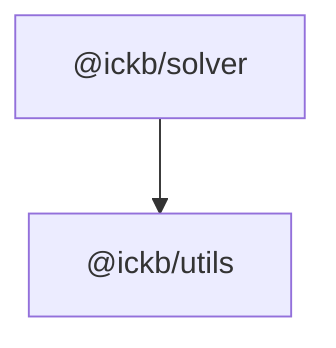

# iCKB/Solver

A Linear Solver, a barebones fork of [Ivordir/YALPS](https://github.com/Ivordir/YALPS).

## Dependencies

## Epoch Semantic Versioning

This repository follows [Epoch Semantic Versioning](https://antfu.me/posts/epoch-semver). In short ESV aims to provide a more nuanced and effective way to communicate software changes, allowing for better user understanding and smoother upgrades.

## Licensing

This source code, crafted with care by [Ivordir](https://github.com/Ivordir) and slightly modified by [Phroi](https://phroi.com/), is freely available on [GitHub](https://github.com/ickb/solver) and it is released under the [MIT License](./LICENSE).